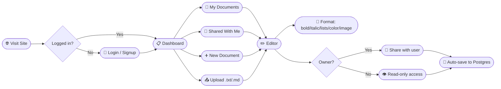
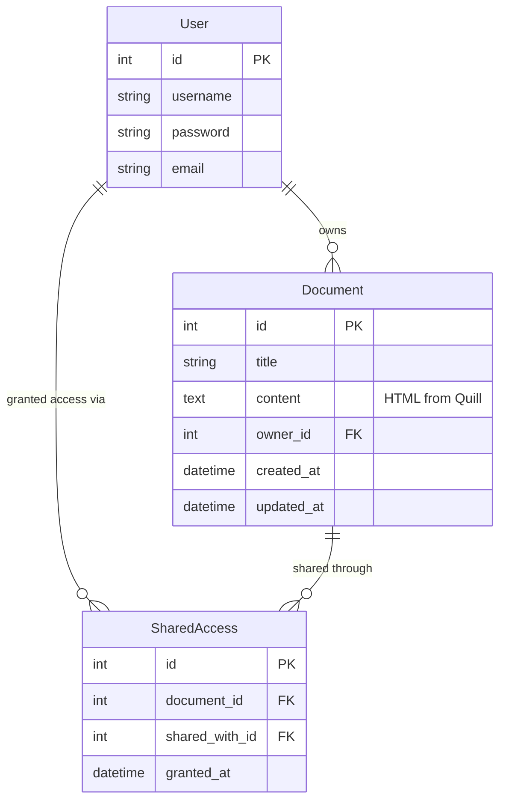

<div align="center">


<br/>

[](https://djangoproject.com)
[](https://python.org)
[](https://neon.tech)
[](https://quilljs.com)

<br/>

**DocsApp** is a Google Docs-inspired collaborative document editor — create, format, share, and persist documents with a real Postgres backend, built for the Ajaia AI-Native assessment.

**Live Demo:** https://docs-81gt.onrender.com
*(free-tier hosting — first load may take 30–60s to wake up)*

</div>

---

## 🔑 Test Credentials

| Username | Password   |
|----------|------------|
| alice    | alice123   |
| bob      | bob123     |
| charlie  | charlie123 |

Or sign up for a new account directly from the login page.

---

## 🗺️ User Flow



---

## 🗄️ Database Schema



**Access control logic:** a user can open `/document/<id>/` if they are the `owner` OR have a matching `SharedAccess` row. Only the owner can edit content or create new shares — enforced at the view level on every POST.

---

## ✨ Features

| Feature | Details |
|---|---|
| **Document Editing** | Create, rename, edit — rich text via Quill.js (bold, italic, underline, headings, lists, text/background color, image embed) |
| **File Upload** | `.txt` / `.md` → instantly becomes a new editable document |
| **Sharing** | Owner grants access to other users; dashboard separates "My Documents" vs "Shared With Me" |
| **Persistence** | Neon Postgres — documents & shares survive refreshes and redeploys |
| **Auth** | Manual signup/login (no OAuth), seeded demo users included |

---

## ⚙️ Tech Stack

| Layer | Technology |
|---|---|
| Backend | Django 5.2 (server-rendered templates) |
| Editor | Quill.js 1.3.6 (CDN) |
| Database | PostgreSQL (Neon, serverless) |
| Deployment | Render (Gunicorn) |
| Auth | Django's built-in `User` model + session auth |

---

## 🚀 Local Setup

```bash
# 1. Clone the repo
git clone https://github.com/life2-byte/Docs
cd Docs

# 2. Create virtual environment & install dependencies
python -m venv venv
source venv/bin/activate   # Windows: venv\Scripts\activate
pip install -r requirements.txt

# 3. Create a .env file in the project root
DBNAME=your_neon_db_name
DBUSER=your_neon_user
DBPASSWORD=your_neon_password
DB_HOST=your_neon_host
DB_PORT=5432

# 4. Run migrations
python manage.py migrate

# 5. (Optional) seed demo users
python manage.py shell
>>> from django.contrib.auth.models import User
>>> User.objects.create_user(username='alice', password='alice123')
>>> User.objects.create_user(username='bob', password='bob123')
>>> User.objects.create_user(username='charlie', password='charlie123')

# 6. Run the server
python manage.py runserver
# Visit → http://127.0.0.1:8000/
```

---

## ✅ Running Tests

```bash
python manage.py test documents
```

14 automated tests covering model creation, access control (owner vs. shared vs. unauthorized), document editing, sharing logic, and file upload validation.

---

## 🚧 Known Limitations / Scope Cuts

- File upload supports **only `.txt` and `.md`** — not `.docx`/`.pdf` (kept scope focused per assignment guidance)
- Sharing is binary (has access / no access) — no granular view-only vs. edit permissions
- No real-time collaboration (single-editor-at-a-time model)
- Tables are not supported in the rich-text editor (Quill's core doesn't include this without a heavier plugin)

## 🛣️ What I'd Build Next (2–4 more hours)

- [ ] Granular sharing permissions (view-only vs. edit)
- [ ] Real-time collaborative cursors (WebSockets/Django Channels)
- [ ] Document version history
- [ ] Export to PDF/Markdown

---

<div align="center">


Built for the Ajaia AI-Native Full Stack Developer Assessment

</div>
